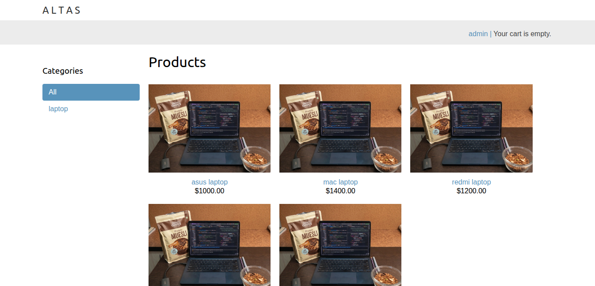
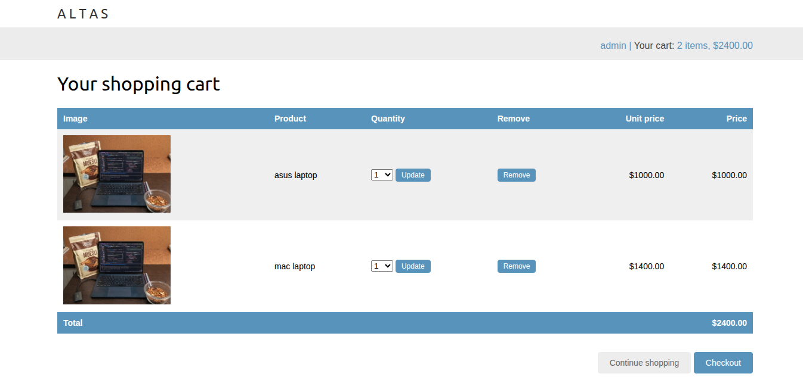
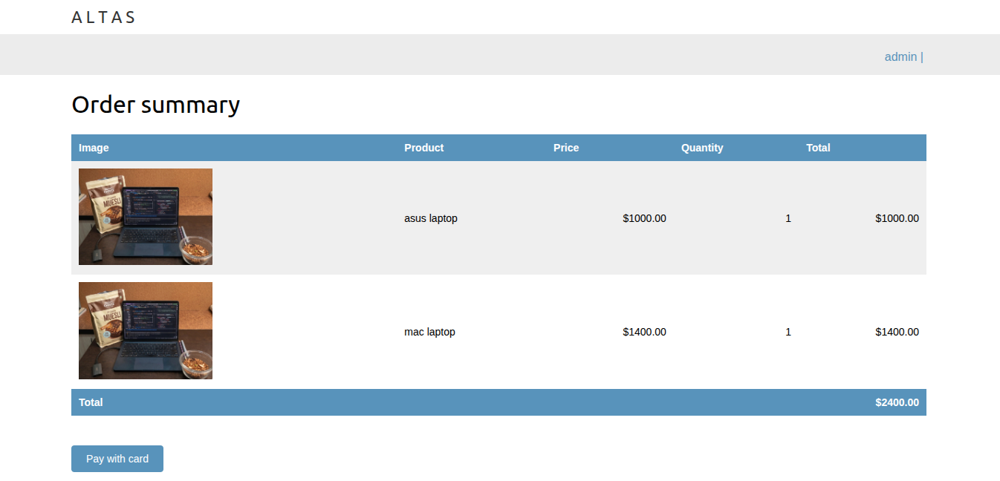
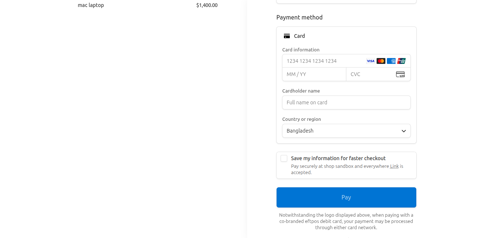
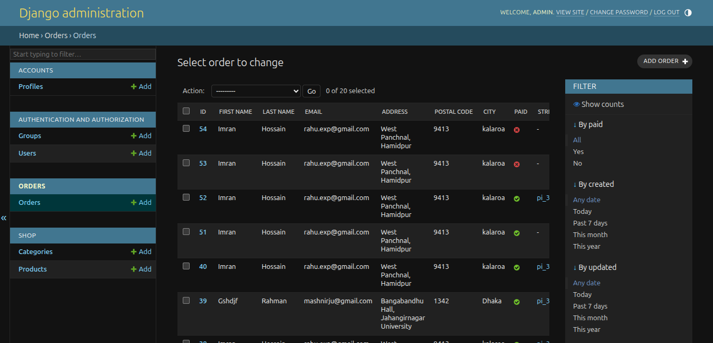

# Shop — Full-Stack E-Commerce Platform

A production-ready e-commerce web application built with **Django & Django REST Framework**, featuring real Stripe payments, async task processing, and a fully containerized deployment pipeline.

**Live Demo:** https://altas.duckdns.org/

**Screenshots:** see below

---

## Features

| Feature | Description |
|---|---|
| User Authentication | Signup, login, and session management |
| Product Catalog & Cart | Browse products, add/remove items from cart |
| Stripe Payment Integration | Secure checkout with real payment processing |
| Order History | Users can view past orders and order status |
| Admin Dashboard | Manage products, orders, and users via Django Admin |
| Async Task Processing | Celery + RabbitMQ handle background jobs (e.g., order confirmation, emails) |
| Fully Containerized | Docker Compose spins up the entire stack (app, DB, broker, reverse proxy) |
| Production Deployment | Nginx reverse proxy, deployed on Google Cloud Platform |

---

## Tech Stack

| Layer          | Technology                          |
|----------------|--------------------------------------|
| Backend        | Python, Django, Django REST Framework |
| Database       | PostgreSQL                          |
| Async Tasks    | Celery, RabbitMQ                    |
| Payments       | Stripe API                          |
| DevOps         | Docker, Docker Compose, Nginx, GCP  |
| CI/CD          | GitHub Actions                      |

---

## Screenshots









---

## Getting Started (Local Setup)

### Prerequisites
- Docker & Docker Compose installed
- A Stripe account (test API keys)

### Setup

```bash
# Clone the repo
git clone https://github.com/Rahu-ju/shop.git
cd shop

# Create .env and .env.prod for local development and production grade environment
# In .env.example you can find all the variables needed
# Then fill in your own values (Stripe keys, DB credentials, etc.)

# Build and run all services for local development
docker compose up --build -d

# Or If you like to spin up production grade envronment
docker compose -f docker-compose-prod.yml up --build -d
```

The app should now be running at `http://0.0.0.0:8000` for development environment
The app should now be running at `http://0.0.0.0:80` for production grade environment


### Environment Variables

Create a `.env` for devlopment and `.env.prod` for production grade environment based on `.env.example` with values such as:

```
DEBUG=False
SECRET_KEY=your-secret-key
DATABASE_URL=postgres://user:password@db:5432/shop
STRIPE_PUBLIC_KEY=pk_test_xxxxx
STRIPE_SECRET_KEY=sk_test_xxxxx
CELERY_BROKER_URL=amqp://rabbitmq:5672
```

---

## Architecture Overview

The application runs as a set of containerized services orchestrated with Docker Compose, split across two isolated networks: a `frontend` network (the only one with internet access) and a `backend` network (internal service-to-service communication only).

```
                        Internet
                           │
                    ┌──────┴──────┐
                    │    Nginx    │  (frontend + backend network)
                    │  reverse    │  - Handles all incoming requests
                    │   proxy     │  - Serves static files
                    └──────┬──────┘  - Talks to web via Unix socket
                           │
              ─────────────────────────  backend network (internal only)
                           │
                    ┌──────┴──────┐
                    │     Web     │  Django + DRF application
                    └──────┬──────┘
                           │
              ┌────────────┼────────────┐
              │            │            │
       ┌──────┴─────┐┌─────┴─────┐┌─────┴─────┐
       │  PostgreSQL ││  RabbitMQ ││   Celery   │
       │  (database) ││ (message  ││  (worker)  │
       │             ││  broker)  ││            │
       └─────────────┘└─────┬─────┘└────────────┘
                             │
                       ┌─────┴─────┐
                       │   Flower  │  Celery monitoring dashboard
                       └───────────┘
```

**Services:**

| Service | Role |
|---|---|
| **Nginx** | Entry point for all incoming traffic; communicates with the `web` container over a Unix socket; also serves static files directly |
| **Web** | The Django/DRF application — handles all business logic and API endpoints |
| **PostgreSQL** | Primary relational database |
| **RabbitMQ** | Message broker required by Celery for queuing background tasks |
| **Celery** | Background worker — sends transactional emails (payment confirmations, signup verification links) asynchronously |
| **Flower** | Web-based monitoring dashboard for Celery tasks and workers |

**Networking:**
- Two isolated Docker networks: `frontend` and `backend`
- Only the `frontend` network has internet access — Nginx is the sole entry/exit point
- All inter-service communication (web ↔ database, web ↔ broker, celery ↔ broker, etc.) happens over the internal `backend` network, which is not exposed externally
- This separation limits the attack surface — the database, broker, and worker are never directly reachable from outside

See `docker-compose-prod.yml` for the full service definitions.

---

## Project Status

This project is actively deployed in production and demonstrates a complete backend workflow — from user auth through to payment processing and order fulfillment — built to reflect real-world e-commerce requirements.

---

## Author

Built by Md Imran Hossain Rahu — self-taught Python/Django developer with a background in Physics, specializing in scalable backend systems and payment integrations.

- [LinkedIn](https://www.linkedin.com/in/rahu/)
- Open to freelance, contract, and remote roles

